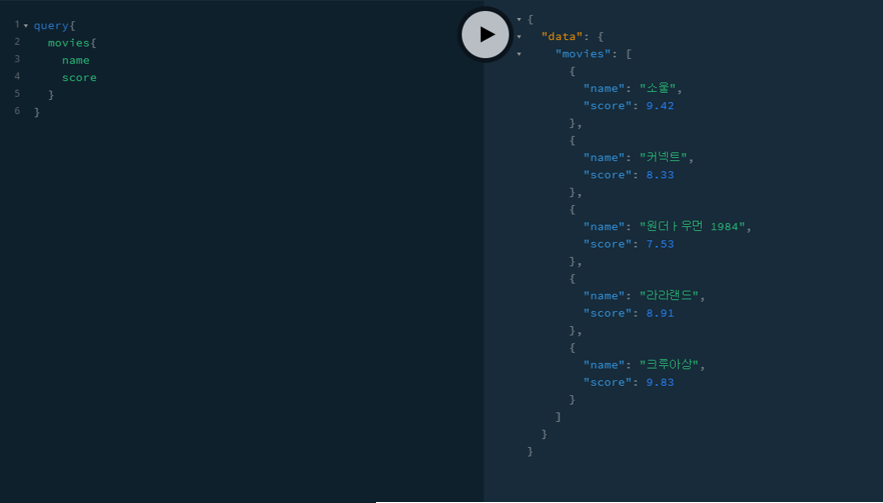
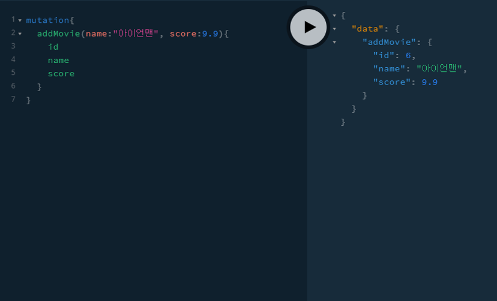

# GraphQL로 영화 API 만들기
### 🎬 Movie API with Graphql(yts api 사용.)
> 노마드코더 Course 중 GraphQL로 영화 API 만들기 프로젝트입니다.


### GraphQL 특징

#### 1. 하나의 endpoint만 존재

#### 2. URL ❌


### GraphQL 요소

#### 1.  Query

- DB로부터 정보를 **받아올때** 사용(R)

```js
query {
    movies {
        name
        score
    }
}
```

- **실행화면**

 


#### 2. Mutation

- 서버 혹은 DB에서 정보를 **변형하는** 작업을 할 때 사용(CUD)

```js
mutation {
    addMovie(name:"아이언맨", score:9.9) {
        id
        name
        score
    }
}
```

- **실행화면**

 


### 3. schema.graphql

  : 사용자가 받거나 줄 정보에 대한 **서술, 설명**


### 4. Reslover

  : Query를 **resolve**(**해결**)

- Ex.

```js
const resolvers = {
    Query:{
        movies: () => getMovies(),
        movie: (_, { id }) => getById(id),
    },
    Mutation:{
        addMovie: (_, { name, score }) => addMovie(name, score),
        deleteMovie: (_, { name }) => deleteMovie(name),
    }
}

export default resolvers;
```


### 5. index.js

```js
import { GraphQLServer } from 'graphql-yoga';
import resolvers from './graphql/resolvers';

const server = new GraphQLServer({
    typeDefs: 'graphql/schema.graphql',
    resolvers: resolvers,
});

server.start(() => console.log('GrapQL Server Running'));
```


### playGround

- DB를 **테스트** 할 수 있는 곳.(Postman과 비슷)


### GraphQL로 해결할 수 있는 문제


#### 1. Over-fetching

- 요청한 영역의 정보보다 많은 정보를 서버에서 받아오는 문제

#### 2. Under-fetching

- REST API에서 하나를 완성하려고 많은 소스를 요청해야 하는 문제


### 기타 설정

> **nodemon** : 변경사항이 생겼을 때 서버를 재시작
>
> yarn add babel=node -- dev
> yarn global add babel-cli --ignore-engines
>
> yarn add babel-cli babel-preset-env babel-preset-stage-3 --dev


### 🏆 [Certificate](https://github.com/souvenir718/TIL/blob/master/Certificate/GraphQL%EB%A1%9C%20%EC%98%81%ED%99%94%20API%20%EB%A7%8C%EB%93%A4%EA%B8%B0.pdf)


### 🎉 다음 코스!

###### [GraphQL로 영화 웹 앱 만들기](https://nomadcoders.co/react-graphql-for-beginners)
